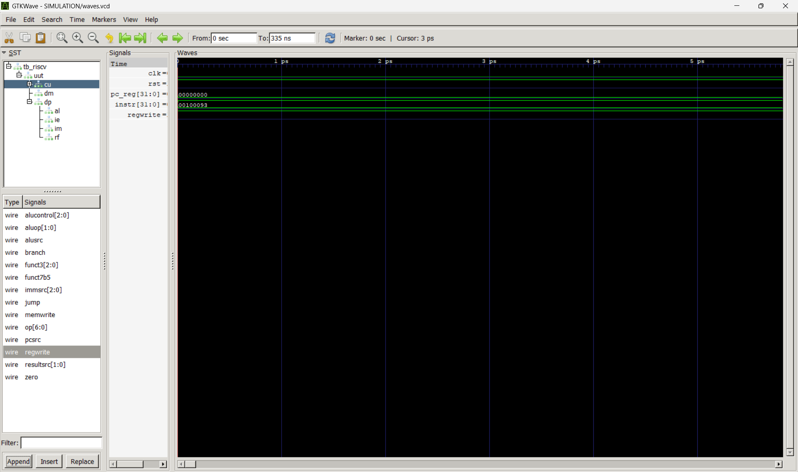

# RV32I RISC-V Processor Core

A fully functional single-cycle RV32I RISC-V processor implemented in Verilog HDL.

📊 [Microarchitectural Performance Analysis](PERFORMANCE.md)

## Features
- Complete RV32I base integer instruction set (ADD, SUB, AND, OR, XOR, LW, SW, BEQ, JAL, LUI)
- Single-cycle implementation
- Verified with Icarus Verilog simulation
- Waveform analysis with GTKWave

## Module Hierarchy
    riscv_core (top)
    +-- datapath
    |   +-- imem    : Instruction memory
    |   +-- regfile : 32 x 32-bit register file
    |   +-- imm_ext : Immediate sign extender
    |   +-- alu     : Arithmetic logic unit
    +-- control_unit
    |   +-- main_dec : Main decoder
    |   +-- alu_dec  : ALU decoder
    +-- dmem : Data memory

## Simulation Results - Fibonacci Sequence
Program computes first 8 Fibonacci numbers using ADD instructions.

x1  = 1
x2  = 1
x3  = 2
x4  = 3
x5  = 5
x6  = 8
x7  = 13
x8  = 21

## Waveform

## How to Simulate
    iverilog -o SIMULATION/riscv_sim.vvp SIMULATION/tb_riscv.v RTL/riscv_core.v RTL/datapath.v RTL/control_unit.v RTL/main_dec.v RTL/alu_dec.v RTL/regfile.v RTL/alu.v RTL/imm_ext.v RTL/imem.v RTL/dmem.v
    vvp SIMULATION/riscv_sim.vvp
    gtkwave SIMULATION/waves.vcd

## Tools Used
- Icarus Verilog v12
- GTKWave v3.3.100
